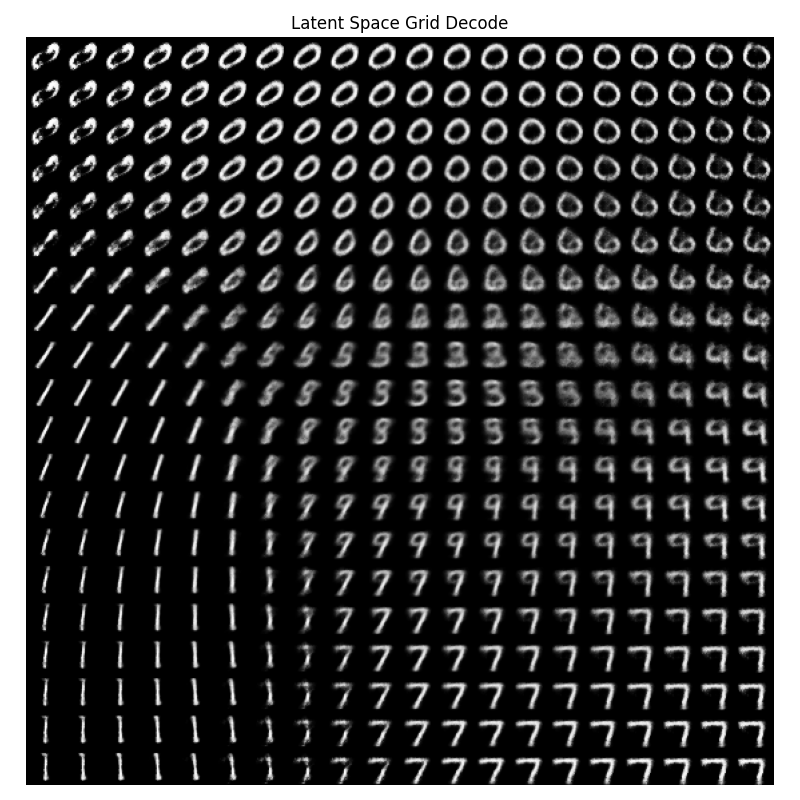
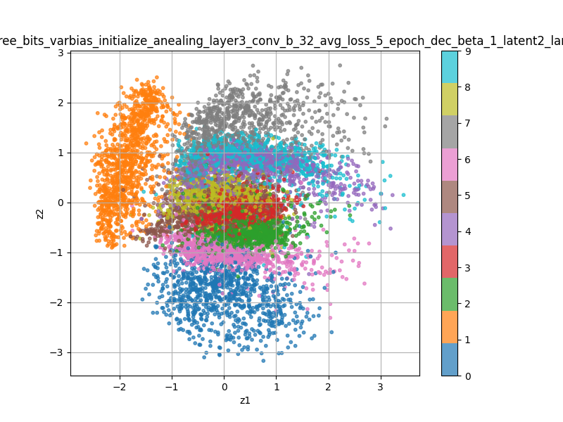

# 🌀 VAE-Playground

MNIST を題材に **Variational Auto-Encoder (VAE)** をゼロから実装し、  
学習・可視化・インタラクティブ操作までを一気通貫で体験できるデモリポジトリです。

| Key Features | 概要 |
|--------------|------|
| 🔧 **学習スクリプト** | `train/run_vae_grid.py` で AE / VAE / ConvVAE をグリッドサーチ |
| 📊 **可視化ユーティリティ** | `visualize_latent_grid.py` で latent→画像グリッド、scatter 保存 |
| 🖥️ **Streamlit GUI** | `visualize/visualize_latent_interactive.py` でスライダー付き探索 |
| 📑 **ログ自動保存** | loss・KL・GPU 使用量を JSON 出力 (`logs/*.json`) |

---

## ✨ デモスクリーンショット

| 数字グリッド (decoder 出力) | Latent 可視化 (scatter) |
|-----------------------------|-------------------------|
|  |  |

*左：`z` 空間を \[-3, 3\]² でサンプリングして decode した結果。  
右：学習後に `μ` をプロット（色はラベル）。クラスタが綺麗に分離。*

---

## 🚀 クイックスタート

```bash
git clone https://github.com/<your-account>/vae-playground.git
cd vae-playground
uv pip install -r requirements.txt  # or pip

# 1️⃣ 学習（例: ConvVAE latent=2 / β=1 / 5 epoch）
uv run train/run_convVAE_grid.py --latent_dim 2 --epochs 5

# 2️⃣ 可視化データ生成
uv run visualize/visualize_latent_grid.py   # *.png と *.npy が samples/latent_vis に出力

# 3️⃣ Streamlit GUI 起動
streamlit run visualize/visualize_latent_interactive.py
````

ブラウザで `http://localhost:8501` を開き、
上部スライダーで `z1`, `z2` を動かすと **右側の生成画像** がリアルタイム更新。
散布図上の赤い ✕ が現在の `z` 座標を示します。

---

## 🗂️ ディレクトリ構成

```
.
├─ models/                # ConvVAE / MLPVAE 実装
├─ train/                 # 学習スクリプト
├─ visualize/             # 可視化 & GUI
│   ├─ visualize_latent_grid.py
│   └─ visualize_latent_interactive.py
├─ samples/
│   └─ latent_vis/        # 生成画像・scatter.npy 等
├─ logs/                  # JSON 形式の学習ログ
└─ CHENGELOG.md           # 開発履歴・設計メモ
```

---

## 🛠️ 開発メモ（抜粋）

* **Free Bits + β warm-up** で posterior collapse を抑制
* Decoder を 1 段拡張（ConvTranspose + LeakyReLU）して再構成品質を改善
* `@st.cache_resource`＋`.npy` キャッシュで Streamlit 起動を高速化
* 詳細な変更履歴は [CHENGELOG.md](CHENGELOG.md) を参照 ✔︎

---

## 📋 TODO

* [ ] latent\_dim > 2 用：PCA / UMAP 射影 + スライダー UI
* [ ] お気に入り z をスナップショット保存 → GIF 生成
* [ ] HuggingFace Spaces へのワンクリックデプロイ
* [ ] 外部画像を encoder に通して z 推定するアップロード機能

---

## 📝 ライセンス

MIT License

